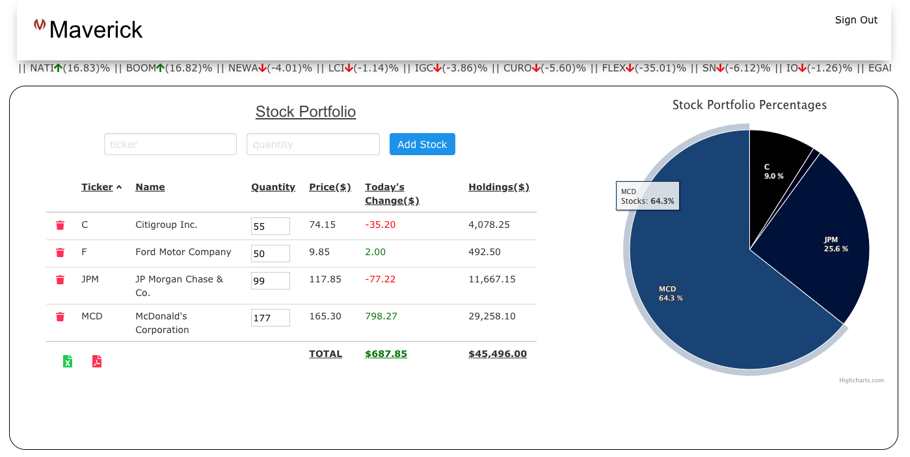
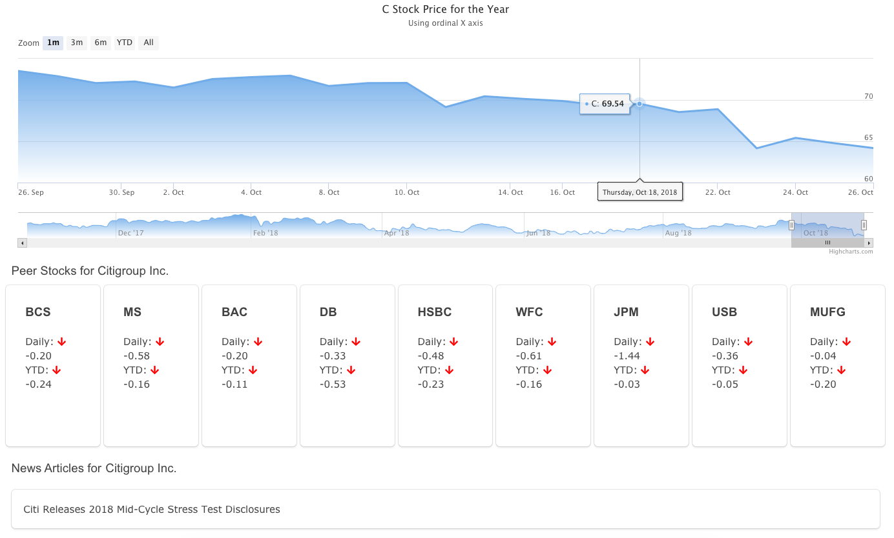

# Maverick

[Maverick](https://maverickstockportfolio.herokuapp.com/) is a stock portfolio management dashboard. Grey Financial has developed the legacy code to strengthen its UX by adding new features and utilizing new external APIs.

_This project is forked from [TeamMaverick's Original Project](https://github.com/TeamMaverick/MaverickStockPortfolio/)_

## Table of Contents

1. [Team](#legacy-team)
1. [Features](#features)
1. [Screenshots](#screenshots)
1. [Built With](#built-with)
1. [Git Workflow](#git-workflow)
1. [Styling](#styling)
1. [License](#license)

## Legacy Team

**Members**: Julie Jung, Paul Chung, Justin Chung

## Features

- User stock portfolio with data from Alpha Vantage
- Autocomplete searching of stocks by either name or ticker
- Dynamically rendered portfolio chart
- Realtime stock performance visualization
- Peer stock comparison and relevant news articles
- Infinite scroll showing best and worst daily performers
- Signup and login using Firebase

## Screenshots





## Built With

- [React](https://reactjs.org/)
- [Express](https://expressjs.com/)
- [MySQL](https://www.mysql.com/)
- [Sequelize](http://docs.sequelizejs.com/)
- [Firebase](http://firebase.google.com/)
- [Axios](https://github.com/axios/axios)
- [Bulma](https://bulma.io/)
- [High Charts](https://www.highcharts.com/)

## Git Workflow

[GreyFinancial Workflow](WORKFLOW.md)

## Development

1. Must include .env file in root directory. (example below)

   ```
   PORT=example
   API=https://www.alphavantage.co/query
   API_KEY=example
   API_ticker=https://api.iextrading.com/1.0
   host=example.rds.amazonaws.com
   dbuser=example
   dbpassword=example
   database=example
   ```

1. Run _npm run db:setup_ to seed the database.
1. Run _npm run test_ to run tests.

## Styling

Maverick uses the [Airbnb JavaScript Style Guide](https://github.com/airbnb/javascript/).

## License

Maverick uses the [MIT License](LICENSE.md).
